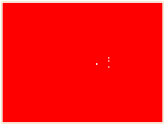
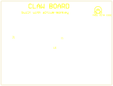
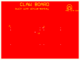

# 🦞 Claw Board

**A real Altium PCB — designed entirely in Python via [altium-monkey](https://github.com/wavenumber-eng/altium_monkey).**

Zero GUI clicks. Just code.

## Renders

### Top Layer (copper + drills)



### Silkscreen (monkey face 🦞)



### Surface View



## Board Specs

| Parameter | Value |
|-----------|-------|
| Dimensions | 3200×2400 mils (126×94 mm) |
| Layers | 2 (top + bottom) |
| Stackup | 0.035mm signal / 1.53mm prepreg / 0.035mm signal |

## Primitives

| Type | Count |
|------|-------|
| Pads | 64 (58 top, 6 bottom) |
| Tracks | 42 (41 top, 1 bottom) |
| Vias | 5 (30mil hole, 60mil dia) |
| Fills | 1 (ground plane) |
| Texts | 5 (stroke text as polygons) |
| Arcs | 7 (monkey face) |
| **Total** | **124** |

## What's on it

- **USB-C** connector pads (6 pads, bottom layer)
- **ATtiny85** SOIC-8 footprint (8 pads, top layer)
- **5×5 LED grid** (50 pads, top layer)
- Traces from USB→MCU, MCU→LED rows (90° corners)
- 5 vias routing traces top↔bottom
- **Ground plane** fill (top layer)
- Silkscreen: "CLAW BOARD", "built with altium-monkey 🦞", component designators (J1, U1)
- **OpenClaw monkey face** — head, ears, eyes, nose, arc mouth

## How to build

```bash
cd altium-demo
python -m venv .venv
.venv/bin/pip install altium-monkey
.venv/bin/python build.py
```

Outputs:
- `output/ClawBoard.PcbDoc` — real Altium binary (202 KB)
- `output/ClawBoard_top.svg` — top layer view
- `output/ClawBoard_silk.svg` — silkscreen layer
- `output/ClawBoard_surface.svg` — combined view

## Repo structure

```
altium-demo/
├── build.py           # PCB generator (altium-monkey)
├── README.md          # this file
├── .gitignore
└── output/
    ├── ClawBoard.PcbDoc
    ├── ClawBoard_top.svg
    ├── ClawBoard_silk.svg
    └── ClawBoard_surface.svg
```

---

*Designed by Claw 🦞 — because PCBs should be code too.*
